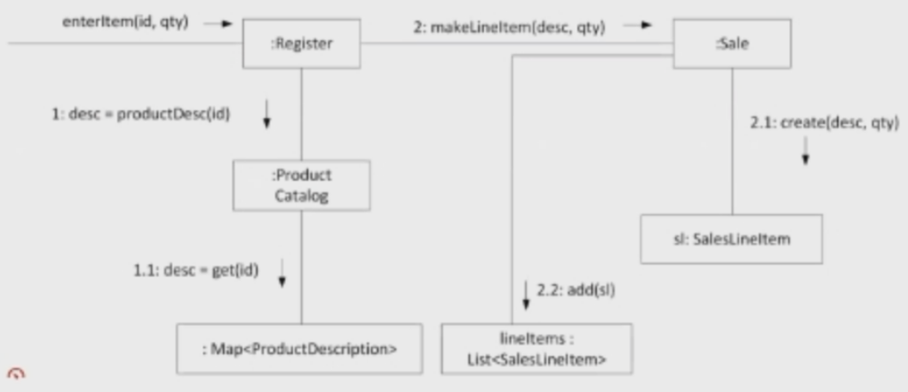
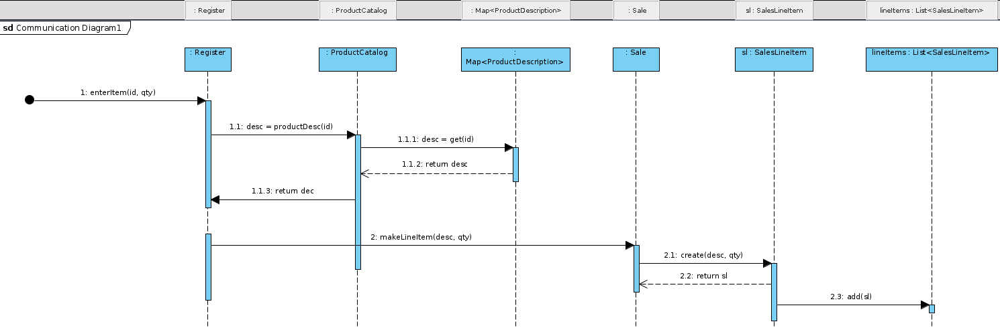
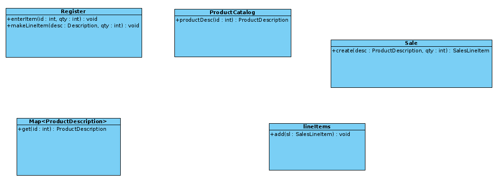
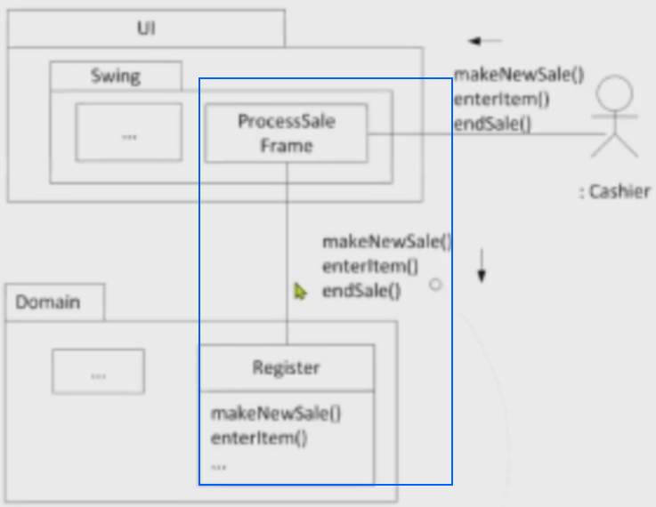
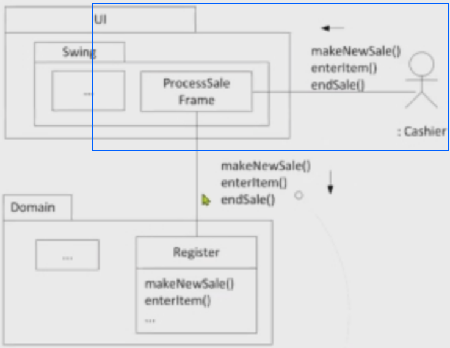
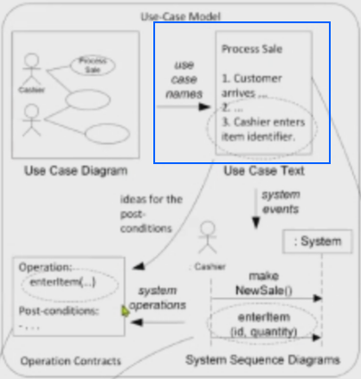

# CS 462 Study Guide

CODE: 7824

## Question 1

### Description

Describe all the things you find done **incorrectly**in the following brief use case description.

**Name:** Order

**Flow of events:** The use case begins when the handler of the order (the handler can be a secretary or a marketing person) presses
“Create a new order” button. After this (s|he ticks the products wanted by the customer from a list presented by the system and
presses the "OK” button. If any of the products selected are not in stock the system will ask whether to cancel the order or to
ship it as Is (incomplete). Pressing the "Cancel order” button cancels the order and the use case ends. 
On the other hand an incomplete order triggers automatic sending of a notification email message to the product handler and the customer telling
about the incomplete order. Normally (i.e. if all the products ordered are in stock), they are reserved immediately by changing
the value of thew status-held to “reserved” in the database. The system also records the order by generating appropriate SQL insert statements and executing them. 
Finally, the system shows a generated report to the order handler, who can print it if so desired. The use case ends.

### Response

- 1 Actor, 1 System, 1 instance
    * This example tries to do too much
    * SSDs should reflect the current scenario like: "Banker takes $50 and deposits into safe A", rather than, "Banker takes cash, sends request to database, SQL is generated, SQL is validated by an external system and the cash is deposited into any safe".
    * It must be concrete
- There should be no mention of UI in this example
    * SSDs are oblivious of the current implementation
    * SSDs can be tied to specific implementations if that is what the diagram is pertaining to, like "Actor clicks on submit button, and the system responds with an OK  message on screen"
- Make sure the actions taken by the actor are noted and are reflected in the SSD

## Question 2

**Original diagram:**

Given the current information, design the following:

- Sequence Diagram
- Class Diagram
    * It is assumed there is no coupling in this example, next coding version does detail missing information

### Convert Communication Diagram &rarr; Sequence Diagram

Please convert this document to LaTeX if you have time. I don't know if I am going blind but I cannot read this picture.

- Shows the flow of events

### Convert Communication Diagram &rarr; Class Diagrams

## Question 3

**NOTE:** please when copying this over, clearly mark them A-D to obtain full marks!

See Figure 17.21

- Responsibility assignment across layers [A]
    * UI component is responsible for handling blitting to the screen and other related matters
    * Domain layer is interested in handling the register and other sales processing events
    * These are seen in the Systems Operation diagram, which is on the right hand side of the large dashed line
    * Each component is responsible for handling a specific task under the module's umbrella. This leads to low coupling and high cohesion.

- Message direction flow and information exchanged [B]
    * This all occurs in the SSD, which is on the left hand side of the large dashed line
    * This is a high level overview of the system at hand
    * Information exchanged between the actor and the system
    * Here is the narrated version of what's happening:
        + An actor "Cashier" requests to create a new sale and the **system does not respond with any information**
        + The actor enters an item using it's identifcation number along with a quantity and the system responds with the item description and total cost of the bundle
        + The actor then terminates the session and the system does not respond with any new information
- Downward collaboration using the Facade Pattern
    * The Facade Pattern allows one method of entry for the system and is considered a front end to the system
    * Implementation details of function bindings are not needed, only what the function produces based on signature
    * An example not present is LLVM which is the front end for the `clang` compiler
    * In this example, we can see there is one point of entry/contact connecting the UI and Domain layer
    * Register has exposed the following functions to be accessible for ProcessSaleFrame
        + makeNewSale
        + enterItem
        + endSale
    * 
    * It is unclear if Register contains other functions, however it is showing that this current actor only has access to these bindings
    * Another section that *may* be a Facade pattern is the Cashier's (actor) view of ProcessSaleFrame
    * 
    * This would also allow for pluggable business rules, where for example, a manger would have a different view than a clerk. Please see page 461, bullet three for more information
- Upward collaboration using the Observer Pattern
    * The observer pattern is defined as having one entity send information to a decentralized destination where consumer entities can obtain that information.
    * It is also known as the producer/consumer pattern (webhooks are an example)
    * Going off the diagram, we can assume that there is some sort of event handler implementation on both the Register and ProcessSaleFrame.
    * In this example, the producer is going to be the register (information is parsed and processed in this black box)
    * The ProcessSaleFrame is the consumer of this information because it needs to display it to the actor of the system
    * Once new information like the total or a price change is alerted via the register, the ProcessSaleFrame will reflect those changes
    * The Register does not care how it is displayed, just that it provides an interface to give said information
    * Upward collaboration means the information from a lower layer propagates *upwards*

- Describe the relationship between the process sale use case text and the system sequence diagram: 
    * The process sale use case text expands upon on the information about the steps the actors and system take which is used in the SSD to show or visualize the interactions between in the actor and system in a  sequence of steps. (i.e. from step 1 to step 5)

- Describe the relationship between the system sequence diagram and the software sequence diagram 
    * The system sequence diagram is a black box diagram where we're only concerned with the input and output while the sequence diagram gets the actual implementation of the diagram 

## Question 4

Please see `Question4.cpp` for the solution

## Question 5

**NOTE:** please when copying this over, clearly mark them A-E to obtain full marks!

- Describe the  Domain Model, Use Case model, SSD, SAD, and Design Model artifacts
    * Domain Model: This illustrates noteworthy concepts in a domain (area of focus, such as Technical or UI). It is similar to a static information model of the domain entities
        + Process: Elaboration Phase 1 (Please see pg 129)
        + Usage area: The design model to note how each entity should interact with one another
    * Use Case Model: A set of typical scenarios using a system. They are primarily used for functional (behavioral) requirements
        + Process: Inception Phase (please see pg 58 and 59)
        + Usage area: to be used alongside the supplementary specification, glossary, vision and business rules to construct a clear picture of how the system should operate (DESIGN MODEL?)
    * SSD: given a scenario, convey how the actor will interact with the system. This should *NOT* include any mention of UI and is only concerned with information exchanged
        + Process: Elaboration Phase 1
        + Usage area: Design Model to show how the system is to behave during runtime
    * SAD: a summary of the architectural decisions and the N+1 architectural views
        + Process: Elaboration Phase 1
        + Usage area: alongside the design model to show how the system's architecture is comprised
    * [Design Model](https://www.ibm.com/docs/en/rsas/7.5.0?topic=model-design): the set of diagrams that describe the logical design
        + Process: Elaboration Phase 1
        + Usage area: during the implementation
- Describe the steps you have taken to design your project
    * First, we met with our stakeholders to establish the vision and business case which will define the scope of our project
    * Then, we met with our subject matter experts to identify all possible risks that would arise from implementing such a system to create the Risk Management Plan
    * After, we thought of about 10% of the possible Use Cases that the system is capable of and created a use case model to encapsulate them
    * Once we finished that, we moved onto Elaboration Phase 1, which requires us to make design corrections that were needed
    * Software Sequence Diagrams were created to show how the system should interact with specific actors at a high level overview. These are specific to the current instance we are modeling with predefined criteria.
    * During this process, we also needed to create a Software Architecture Document to convey key architectural design choices and explanations of why we selected the current model
    * The domain model was then created to show the how and which objects should interact with each other in terms of coupling and cohesion (not runtime activity)
- Describe the relationship between the Use Case Diagram and the "Process Sale Use Case Diagram"
    * 
    * The relationship between the

## Question 6

The most important thing you can learn in object-oriented analysis and design is to:

- Skillfully assign responsibilities to software objects 

## Question 7

- What object should have the responsibility, when you do not want to violate other goals, but other solutions are not appropriate?
    * Pure Fabrication
- What is the general principle of assigning responsibilities to objects?
    * Information Expert
- How to design objects, subsystems, and system so that the variations or instability on these elements does not have an undesirable impact on other elements?
    * Protected Variations
- How to support low dependency, low change impact, and increased reuse?
    * Low Coupling
- What first object beyond the UI layer receives and coordinates a system operation?
    * Controller
- How to keep objects focused, understandable, and manageable?
    * High Cohesion
- How to handle alternatives based on types? How to created pluggable software components?
    * Polymorphism

## Question 8

A popular way of thinking about the design of software objects and also larger-scale components is in terms of:
- [X] Collaborations
- [X] Roles
- [X] Responsibilities

## Question 9

It's especially during " BLANK " that we apply responsibility-driven design and GRASP principles .

- Domain modeling (I THINK)

## Question 12

The idea behind the Controller GRASP pattern is to separate data from procedures in order to keep classes containing data as reusable as possible:

- [ ] True
- [X] False

## Question 16

The cardinalities between the same classes in analysis and design diagrams maybe different:

- [ ] True
- [X] False

## Question 21

A Use Case driven development process requires one to thoroughly specify and finalize all the use cases before advancing 

- [ ] True
- [X] False
